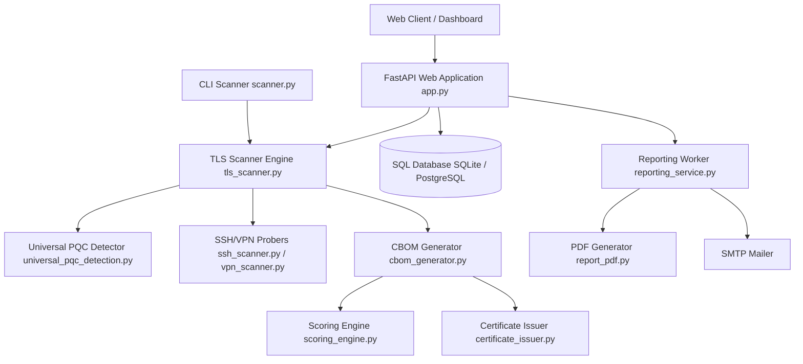

# Q-Shield: Enterprise Post-Quantum Cryptographic Scanner & Inventory Dashboard

*Branding Slogan: "Quantum-Ready Cybersecurity for Future-Safe Banking"*

Q-Shield is a state-of-the-art enterprise cybersecurity tool designed for **Punjab National Bank (PNB)** to audit, map, and assess the quantum readiness of public-facing endpoints (web servers, VPNs, SSH servers, and API endpoints). It generates standardized, FIPS-aligned **Cryptographic Bill of Materials (CBOM)** reports, flags quantum-vulnerable classic algorithms (RSA, ECC, etc.), and evaluates post-quantum readiness via the **Quantum-Aware Readiness Score (QARS)** and **Harvest Now, Decrypt Later (HNDL)** exposure analysis.

---

## Table of Contents
1. [Core Features](#core-features)
2. [Architecture & Engine Details](#architecture--engine-details)
3. [Directory Layout](#directory-layout)
4. [Enterprise Database & Security Controls](#enterprise-database--security-controls)
5. [Local Quickstart & Setup](#local-quickstart--setup)
6. [Docker & OpenSSL 3.6.1 PQC Deployment](#docker--openssl-361-pqc-deployment)
7. [Environment Variables Reference](#environment-variables-reference)
8. [CLI Usage Guide](#cli-usage-guide)
9. [Running Unit Tests](#running-unit-tests)

---

## Core Features

- **TLS and Protocol Scanning**: Identifies supported protocol versions (TLS 1.0, 1.1, 1.2, 1.3) and maps negotiated ciphers.
- **Hybrid Key Exchange (KEX) Detection**: Active client hello probing using raw sockets fallback to confirm support for post-quantum hybrid groups (like `X25519MLKEM768`).
- **Cryptographic Bill of Materials (CBOM)**: Generates detailed cryptographic inventories in compliance with the **CycloneDX v1.6** schema.
- **QARS (Quantum-Aware Readiness Score)**: Assigns a dynamic 0-100 metric based on a weighted rubric representing overall quantum-safe migration progress.
- **HNDL (Harvest Now, Decrypt Later) Risk Engine**: Employs Mosca’s shelf life theorem ($X + Y > Z$) to compute critical deadlines for migrating sensitive transaction assets.
- **PQC-Ready Compliance Certificate**: Signs and issues verifiable, HMAC-secured compliance certificates for endpoints passing PQC hybrid validations.
- **Multi-Target & Subdomain Discovery**: Automated Certificate Transparency (CT) lookups via crt.sh to map the full subdomain perimeter.
- **VPN and SSH Probing**: Inspects SSH (port 22/2222) and VPN configurations (IPsec/OpenVPN ports) for outdated cipher profiles.
- **Automated Scheduled Reporting**: Set up weekly or monthly audits with PDF report generation (using ReportLab) and secure email notifications.

---

## Architecture & Engine Details



### Core Engine Files
1. **`app.py`**: Enterprise FastAPI backend serving API endpoints, web templates, Firebase integration, and managing the background scheduler worker.
2. **`tls_scanner.py`**: Custom raw socket and OpenSSL handshake probe engine that scans target endpoints. Supports extracting negotiated TLS parameters and probing hybrid keys.
3. **`cbom_generator.py`**: Translates raw scanner findings into structured CycloneDX-compliant CBOM records.
4. **`scoring_engine.py`**: Implements Mosca's Theorem for HNDL risk, and calculates the final QARS score.
5. **`certificate_issuer.py`**: Signs and issues cryptographic verification certificates for compliant, quantum-safe endpoints.
6. **`report_pdf.py`**: Generates enterprise-ready, formatted PDF scan reports including charts, tables, and audit logs.
7. **`reporting_service.py`**: Runs scheduled scans and delivers reports automatically via SMTP.

---

## Directory Layout

```
├── app.py                      # FastAPI Web Application & API Server
├── cbom_generator.py           # Cryptographic Bill of Materials (CBOM) Engine
├── certificate_issuer.py       # PQC Verification Certificate Issuer
├── db_init.py                  # Database Schema Initializer Script
├── discovery_engine.py         # Subdomain / DNS Enumerator
├── scanner.py                  # CLI Multi-Target Scanner Orchestrator
├── scoring_engine.py           # QARS & HNDL Risk Evaluation Engine
├── tls_scanner.py              # Low-Level TLS Handshake & Socket Scanner
├── report_pdf.py               # PDF Generation Service (ReportLab)
├── reporting_service.py        # Background Mailer & Scheduler Service
├── ssh_scanner.py              # SSH Encryption Algorithm Scanner
├── vpn_scanner.py              # VPN Perimeter Protocol Scanner
├── universal_pqc_detection.py  # PQC/Hybrid Algorithm Mapping
├── requirements.txt            # Python Dependencies List
├── vercel.json                 # Vercel Deployment Configurations
├── firebase_auth/              # Optional Firebase Auth Enterprise Integration
├── static/                     # CSS, SVG Flow Diagrams, JS Files
├── templates/                  # Tailwind-Styled HTML View Templates
├── samples/                    # Output samples for testing and evaluation
│   └── latest_report.json      # Sample CBOM & Scan Output
└── tests/                      # Core Test Suite
    └── test_tls_scanner.py     # Scanner Unit Tests
```

---

## Enterprise Database & Security Controls

### Database Scalability
Q-Shield uses SQLAlchemy ORM and supports:
- **SQLite** (Default local storage): Perfect for small scale testing and local servers.
- **PostgreSQL**: Recommended for enterprise scale deployment. Configure by setting the `DATABASE_URL` environment variable.

### Access Control & RBAC
Roles are enforced at the API route level:
- **Security Lead / Admin**: Full access to all history, audit logs (`/api/admin/logs`), and scheduler configurations.
- **Analyst**: User-level access (view, search, and export their own scan history).
- **Viewer**: Read-only access to dashboards (no permission to launch new scans).

### Password Hardening
All local user accounts are secured using **Argon2id** (OWASP 2023 Recommendation) with high-iteration PBKDF2 fallback.

---

## Local Quickstart & Setup

### Prerequisites
- Python 3.10+
- Virtual environment tool (`venv` or `conda`)

### 1. Initialize Virtual Environment
```bash
python -m venv .venv
# On Windows:
.venv\Scripts\activate
# On Linux/macOS:
source .venv/bin/activate
```

### 2. Install Dependencies
```bash
pip install -r requirements.txt
```

### 3. Initialize Database
Seeding default tables and default admin credentials:
```bash
# Set credentials (highly recommended for security)
set ADMIN_USERNAME=admin
set ADMIN_PASSWORD=admin123
python db_init.py
```

### 4. Start the Application
Launch the FastAPI development server:
```bash
uvicorn app:app --host 0.0.0.0 --port 8000 --reload
```
Access the application at `http://localhost:8000/login`.

---

## Docker & OpenSSL 3.6.1 PQC Deployment

To achieve **full hardware-level Post-Quantum Cryptography scanning capabilities**, it is highly recommended to run Q-Shield within Docker. The provided `Dockerfile` automatically downloads and compiles **OpenSSL 3.6.1** from source to ensure PQC hybrid group negotiation is natively supported.

### Build and Run Docker Container
```bash
# Build the container
docker build -t qshield:latest .

# Run the container
docker run -d -p 8000:8000 \
  -e ADMIN_USERNAME=pnb_admin \
  -e ADMIN_PASSWORD=SecurePassword2026 \
  -e SESSION_SECRET_KEY=GeneratingAStrongSecretKey \
  qshield:latest
```

---

## Environment Variables Reference

| Variable | Purpose | Default |
|----------|---------|---------|
| `ADMIN_USERNAME` | Custom Admin username seeded at startup | `admin` |
| `ADMIN_PASSWORD` | Custom Admin password seeded at startup | `admin123` |
| `DATABASE_URL` | SQLAlchemy Connection String | `sqlite:///./qshield.db` |
| `SESSION_SECRET_KEY` | Flask-style encryption key for session cookies | `QSHIELD_MOCK_SECRET_KEY` |
| `SMTP_HOST` | Target SMTP Host for reporting | `smtp.gmail.com` |
| `SMTP_PORT` | SMTP communication port | `587` |
| `SMTP_USERNAME` | Auth email user for SMTP server | None |
| `SMTP_PASSWORD` | Auth password for SMTP | None |
| `SMTP_FROM_EMAIL` | Sender email address header | Same as SMTP_USERNAME |
| `SMTP_USE_TLS` | Flag to enable starttls (`1` or `0`) | `1` |
| `DISABLE_SCHEDULE_WORKER` | Toggle scheduler thread (`1` to disable) | `0` |

---

## CLI Usage Guide

Q-Shield includes a full-featured Command Line Interface (CLI) in `scanner.py` for headless or scripted automated scanning.

```bash
# Scan a single domain and display a summary
python scanner.py sc.com --format summary

# Scan multiple domains and output CycloneDX 1.6 CBOM format to a file
python scanner.py pnbindia.in google.com -o pnb_perimeter_cbom.json --format cbom

# Fast scan skipping VPN and SSH port scans
python scanner.py sc.com --no-api-probe --no-headers
```

---

## Running Unit Tests

To verify code integrity and regression protection, execute the test suite:
```bash
python -m unittest discover -s tests -p "test_*.py"
```
